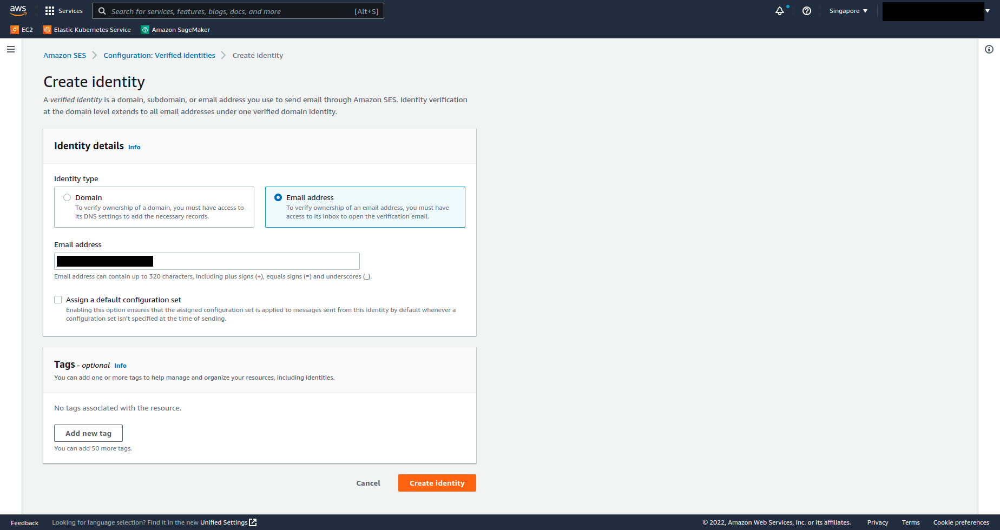
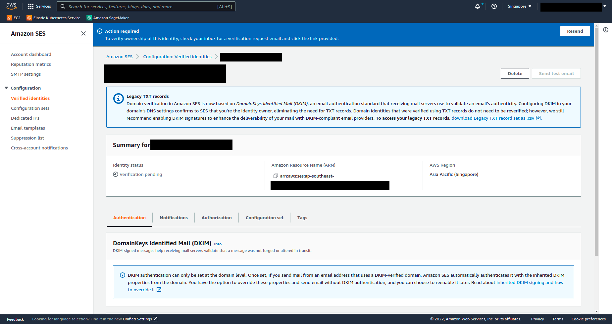
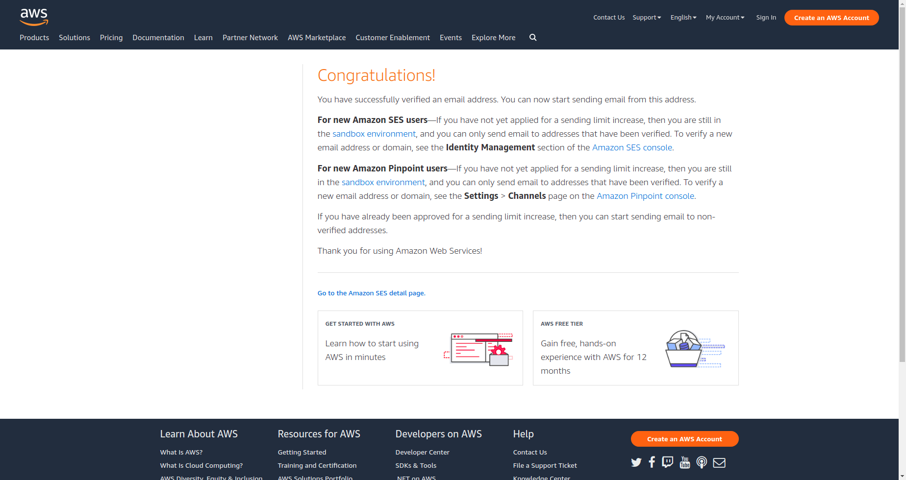
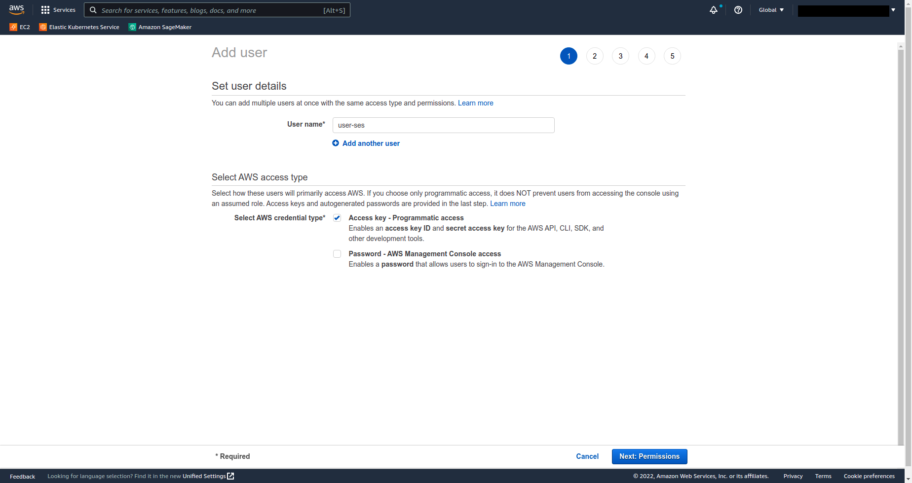
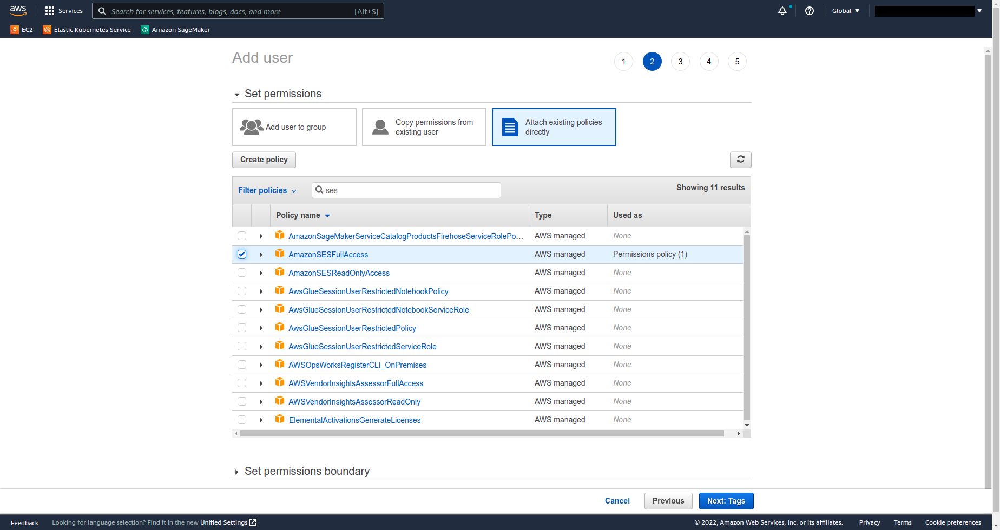
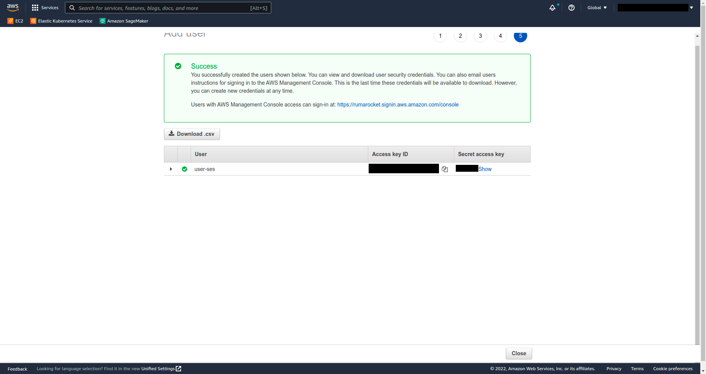
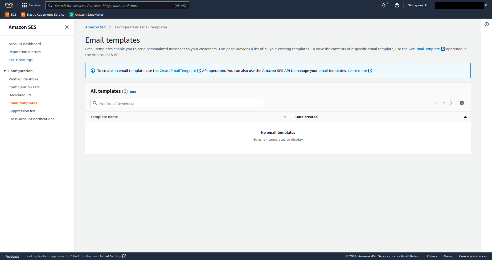
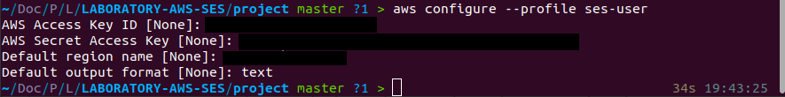
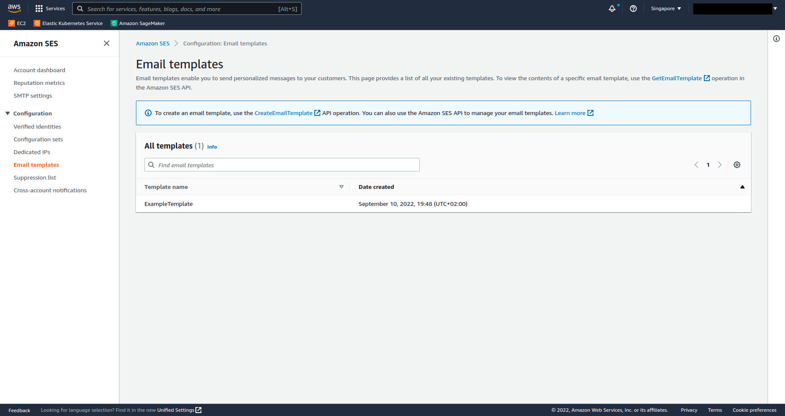

# LABORATORY-AWS-SES

This project is a laboratory for sending email with and without template using the **SES service** from Amazon. This laboratory is an **express** API located in a **NX Workspace**. The connection to SES has been made using the **aws-sdk**

## Plan of the presentation

I explain with all the details how I build the project and my way of working.

- [Development](#development)
- [Running](#running)
- [System](#system)

## Development

#### Prerequisite

- The library aws-sdk

```bash
$ npm install aws-sdk
```

- The aws cli

#### Create a verified email

For sending email using your domain or email, you need to first verify your email. In can be achieved on the aws console, go in the SES service -> configuration -> verified identitites -> create identity.

In the new page, if you are like me and dont have a domain, choose Email Address and enter your email.



A blue message should be shown inviting you to connect to your email address. You should have received an email with a link.



By clicking the link, you should arrive with a congratulation message. At this point, your email has been verified and can be use for sending email.



#### Create a user exclusively for SES

For more security, it's better to create a user restricted to the SES service. In case of hack or if your secret get compromise, the hacker wont be able to do too much damage.

For adding a user, go in the IAM service -> Access Management -> Users -> Create User.

In the new window, enter your name and click the Access Key as a credential.



In the next step, enter SES in the search bar and choose the AmazonSESFullAccess to give the user the control over SES Service.



You can now skip the rest and go directly to the last step. Take note of the credential of this page. It will be the needed information for connecting the SES library in your code.



#### Create a template for your email

If you look in the SES service -> Configuration -> Email Template. You should see that you dont have any template yet.



Adding a template can only be done using the API, since we add a user with full SES access on the previous step, we will use it here. Let's start by creating a profile on your computer.

```bash
$ aws configure --profile ses-user
```



Once done, we can browse to our template and run the following command using the profile we created previously. Careful, this command does not return any result.

```bash
$ aws ses create-template --cli-input-json file://email.json --profile ses-user
```

And if we come back to our aws console, we should be able to see it.



## Running

I am using NX, so for starting the project use the following command:

```bash
$ nx serve api
```

## System

Ubuntu Version: Ubuntu 20.04.1 LTS
Node Version: v16.15.1

```bash
# Get the version of node
$ node -v

# Get the latest version of ubuntu
$ lsb_release -a
```

